# Result & Grade Manager

A professional Student Result and Grade Management application built with Flutter and SQLite.

## Features
- **Splash Screen**: Professional entry animation.
- **Dashboard**: Quick statistics and performance charts.
- **Student Management**: Full CRUD operations for student records.
- **Subject Management**: Manage academic subjects and codes.
- **Marks Management**: Dynamic mark entry and editing per semester.
- **Results Engine**: Automated calculation of Total Marks, Percentage, Grade, and GPA.
- **Performance Analysis**: Visual representation of academic data.

## Tech Stack
- **Framework**: Flutter
- **Database**: SQLite (sqflite)
- **Charts**: fl_chart
- **Typography**: Google Fonts (Poppins)
- **Design**: Terracotta and Peach Theme

## Calculations
- **Grade**: Based on percentage (A+, A, B, C, D, F).
- **GPA**: Scaled dynamically based on percentage achieved.
- **Aggregates**: All results are calculated in real-time from the underlying marks database.
# Result & Grade Manager

## Screenshots

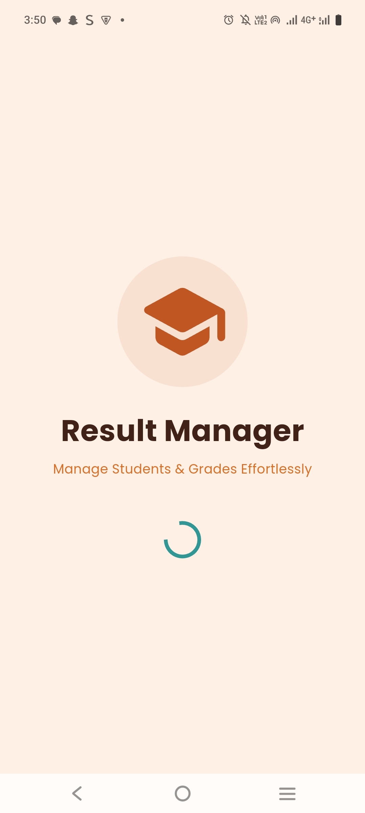

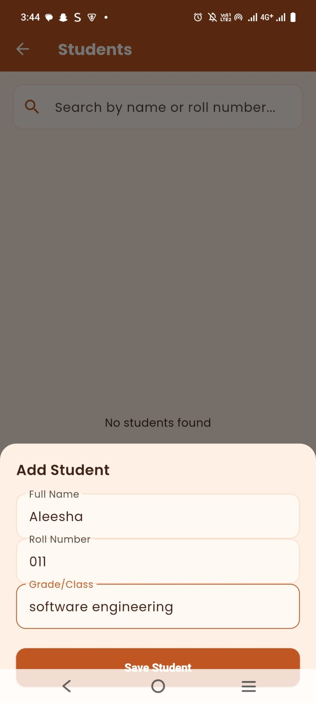
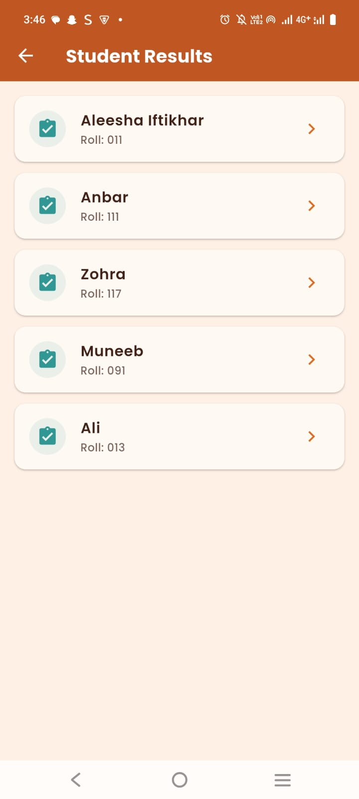
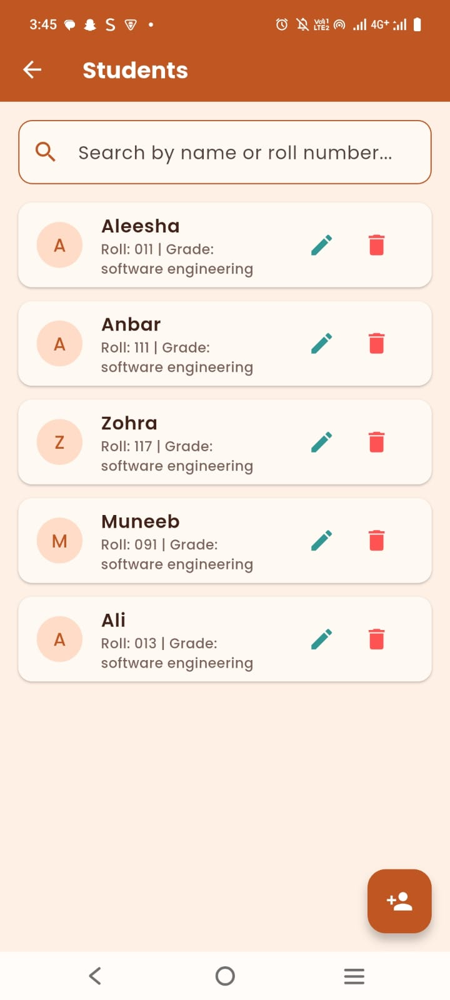
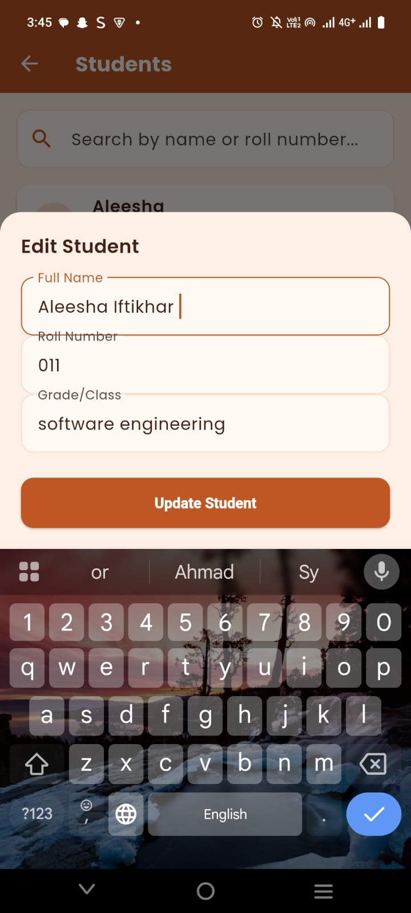
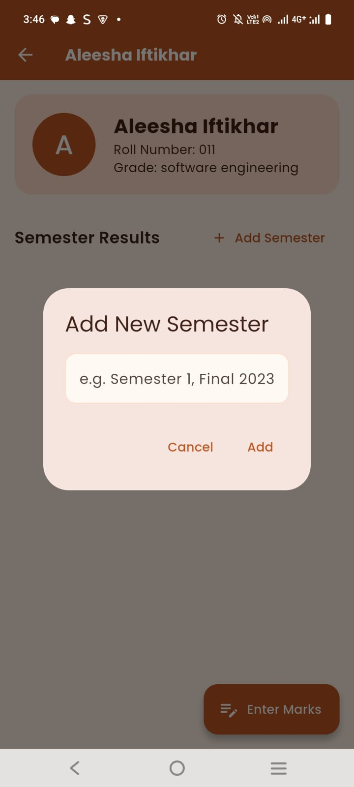
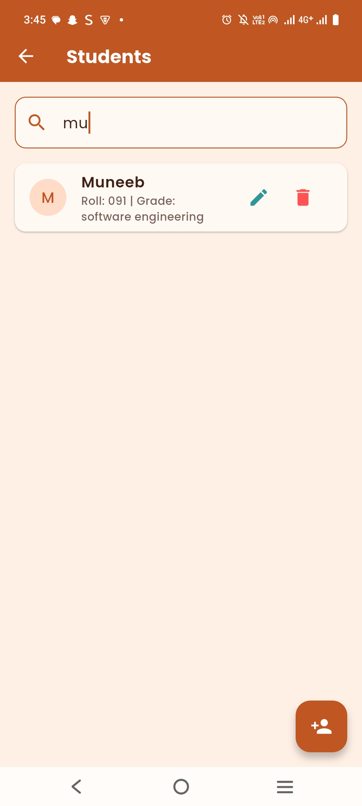
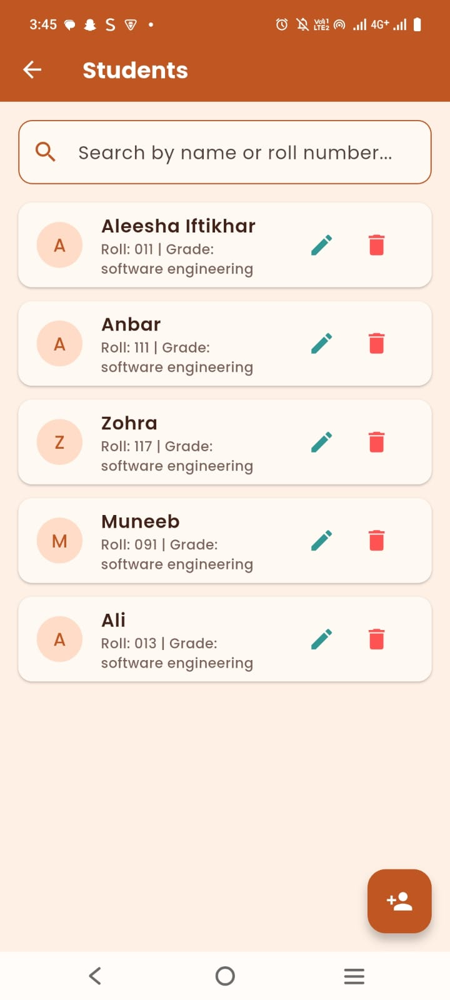
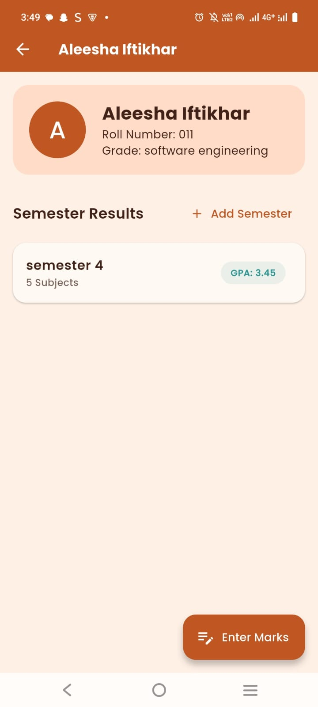
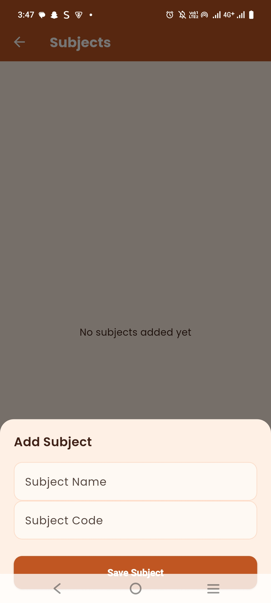
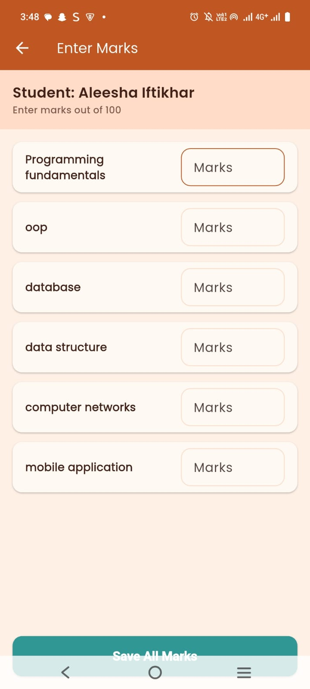
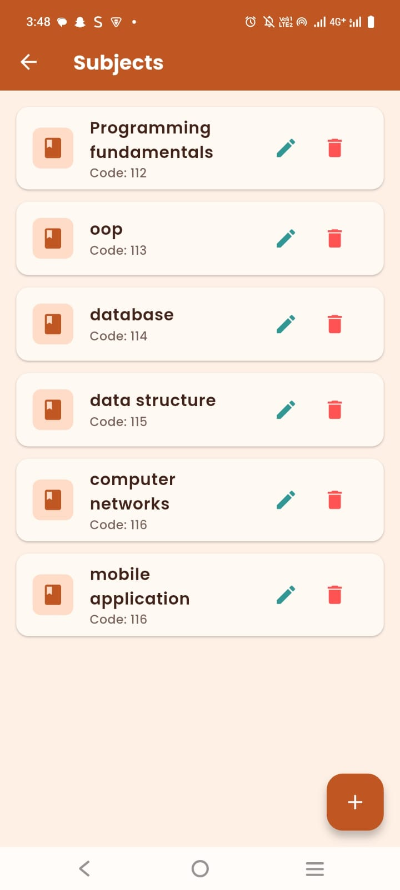

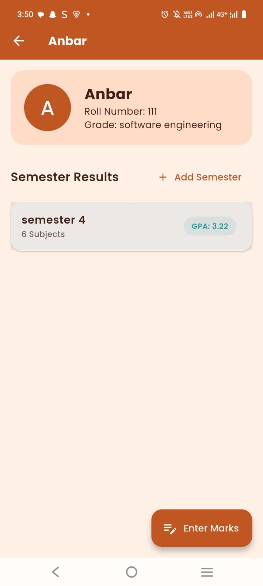
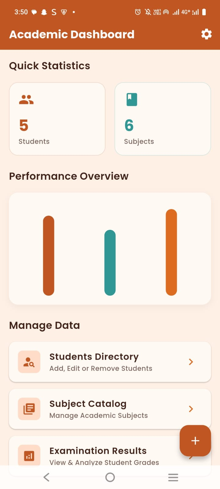